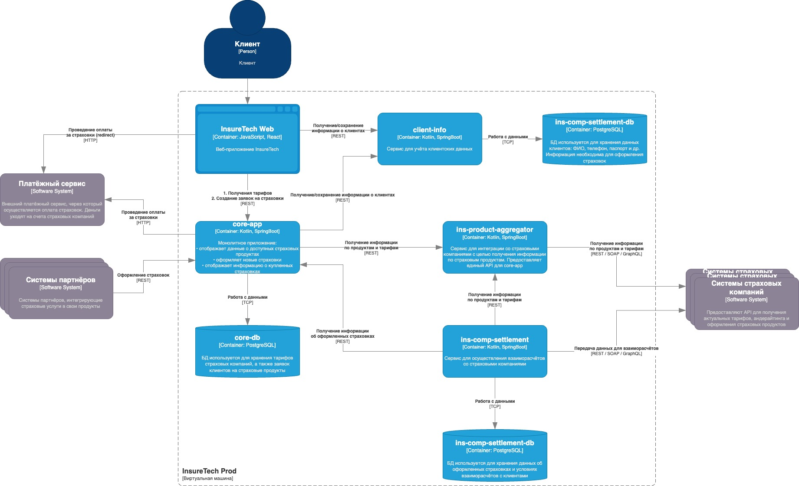

# Задание 3. Переход на Event-Driven архитектуру
Сервисы core-app и ins-comp-settlement получают данные о доступных продуктах через REST API сервиса ins-product-aggregator. В момент вызова он:
запрашивает информацию из всех страховых компаний (сейчас их пять),
- агрегирует её в единый список,
- возвращает этот список в рамках того же синхронного запроса.

Чтобы ускорить работу сервисов, при изначальном проектировании команда решила хранить локальные реплики данных о продуктах и тарифах в сервисах core-app и ins-comp-settlement.
Сервис core-app осуществляет запрос к ins-product-aggregator раз в 15 минут, а ins-comp-settlement — раз в сутки (ночью), при формировании реестра оформленных страховок. Иногда команда сталкивается с ошибками взаимодействия между этими сервисами. Они связаны с задержками ответов или ошибками при взаимодействии с API страховых компаний.
Дополнительно сервис ins-comp-settlement раз в сутки осуществляет запрос в core-app по REST API для получения всех оформленных за день страховок. Эти данные он использует. 
В ближайшее время InsureTech планирует подписать агентское соглашение ещё с пятью страховыми компаниями. Вам предстоит спроектировать решение, которое устранит текущие проблемы.

## Предлагаемые решения
1. Отказ от синхронных вызывов из core-app и ins-comp-settlement в сторону ins-product-aggregator. Фактически происходит дублирование информации. Реализуем cronjob на ins-product-aggregator, который каждые 15 минут опрашивает API страховых компаний и отправляет event через Kafka. core-app и ins-comp-settlement потребляют сообщения из Kafka с той же переодичностью (15 минут и раз в сутки). Сообщения в Kafke храним 2 дня. Позднее можно подумать над выделением отдельных партиций для каждой компании.
2. Отказ от синхронных из ins-comp-settlement в сторону core-app. core-app публикует событие об оформленных страховках. ins-comp-settlement потребляет. Данные храним 2 дня.
3. Transactional Outbox не вижу смысла пока использовать, данные получаем самостоятельным походом в API партнера. Если бы у нас не было витрины данных, api партнера был платный или мы бы получали callback, тогда наверное стоило бы подумать насчет Outbox.

